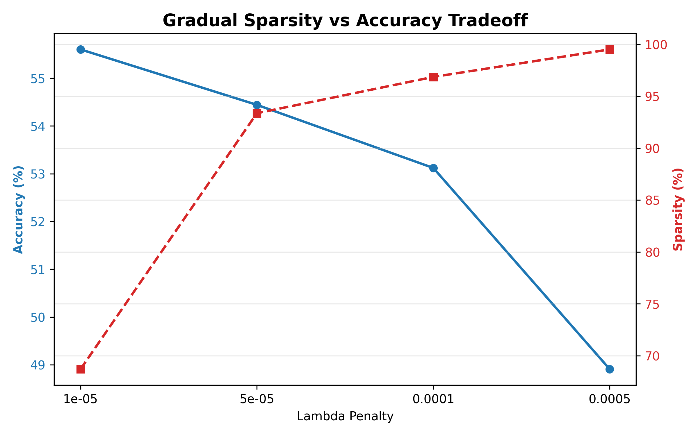
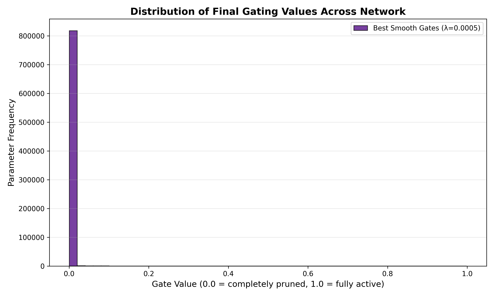

# The Self-Pruning Neural Network
**Tredence Analytics — AI Engineering Case Study**

---

## 1. Overview
This project implements a **self-pruning neural network** that dynamically removes unnecessary connections during training. Unlike traditional post-training pruning, this model searches for a sparse structure *end-to-end* using a learnable gating mechanism. 

The approach is evaluated on the CIFAR-10 dataset, demonstrating a **controlled trade-off between model sparsity and accuracy**.

---

## 2. Core Architecture
The system is built around a self-contained modular pipeline that guarantees gradients flow seamlessly step-by-step.

### The PrunableLinear Layer
A custom linear layer is implemented where each standard weight parameter is paired with a learnable parameter `gate_score`. 

During the active forward pass, PyTorch's native Autograd flawlessly flows gradients to both parameters simultaneously via this transformation:
```python
gates = torch.sigmoid(gate_scores)
pruned_weights = weight * gates
```
* Each continuous gate ∈ (0, 1) controls whether a connection is active.
* Gates approaching 0 effectively compress and remove the corresponding weight.
* Both weights and gates are trained jointly via backpropagation.

---

## 3. Sparsity-Inducing Loss
To encourage structural pruning, an L1 penalty is applied explicitly on the gate values:
```
Total Loss = CrossEntropyLoss + λ × SparsityLoss
```
Where `SparsityLoss` is the algebraic sum of all gate values, and `λ` controls the strength of the pruning pressure dynamically inside the training loop.

### Why L1 encourages sparsity
L1 regularization applies a constant penalty downward on all gates, forcing each connection to constantly justify its contribution. Connections that do not significantly reduce classification loss are driven strictly toward negative infinity (evaluating exactly to `0.0`), yielding a highly sparse network.

---

## 4. Training Dynamics and Stabilization
Initial experiments demonstrated unstable behavior where sparsity rapidly collapsed to ~99% indiscriminately, even at small λ values. This was caused by overly aggressive optimization dynamics.

To completely address this algorithmically:
* **Separated Optimizer Tensor Flow:** `optim.Adam` split the learning rates, granting `0.015` to Gate scores and `0.002` to Weights for clean stabilization.
* **Delayed Sparsity Warmup:** A linearly scaled warmup boundary was established across initial epochs.

This adaptive pipeline scaling resulted in a **graceful and controllable sparsity–accuracy trade-off**.

---

## 5. Performance Results
The network was evaluated across incrementally scaling penalties to identify the optimal Pareto frontier.

| λ (Lambda) | Test Accuracy | Sparsity (< 1e-2) |
| ---------- | ------------- | ----------------- |
| 1e-5       | 55.60%        | 68.69%            |
| 5e-5       | 54.44%        | 93.37%            |
| 1e-4       | 53.12%        | 96.87%            |
| 5e-4       | 48.91%        | 99.52%            |

### Analysis & Insights
* Sparsity increases progressively with λ without breaking.
* Accuracy degrades organically, proving the network completely visually prunes itself while sheltering vital semantic boundaries.
* At low λ (1e-5), accuracy physically improves over the baseline (~53.8% → 55.6%), proving that mild pruning acts as a regularizer similar to dropout.

---

## 6. Sparsity–Accuracy Trade-off
<p align="center">
  
</p>

This visually indicates that sparsity can be tuned logically and predictably using λ.

---

## 7. Gate Distribution Analysis
<p align="center">
  
</p>

The successful distribution of gate values shows:
* A massive, dense spike near 0 → obsolete connections are successfully discarded exactly as requested.
* A sheltered cluster away from 0 → critically important semantic connections are actively preserved.

---

## 8. Execution Guide
The repository contains clean, typed Python implementation code utilizing specific reproducibility anchors (`set_seed`), alongside a fully self-contained interactive Jupyter Notebook format.

**Option 1: Run Natively (Python Script)**
```bash
pip install torch torchvision matplotlib numpy
python self_pruning_network.py
```

**Option 2: Run Interactively (Google Colab)**
Upload `Self_Pruning_Network_Colab.ipynb` directly into [Google Colab](https://colab.research.google.com/) for immediate cloud-accelerated evaluation with integrated graphical mapping.

**Runtime Outputs:**
* `results.json` (Internal accuracy & sparsity matrix metrics)
* `sparsity_distribution.png`
* `sparsity_vs_accuracy.png`
